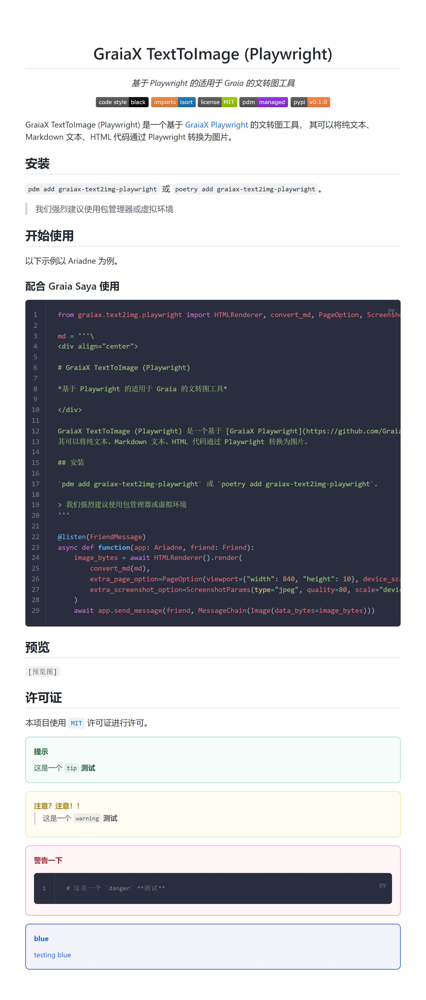

<div align="center">

# GraiaX TextToImage (Playwright)

*基于 Playwright 的适用于 Graia 的文转图工具*

[](https://github.com/psf/black)
[](https://pycqa.github.io/isort/)
[](https://github.com/GraiaCommunity/graiax-text2img-playwright/blob/master/LICENSE)
[](https://pdm.fming.dev)
[](https://img.shields.io/pypi/v/graiax-text2img-playwright)

</div>

GraiaX TextToImage (Playwright) 是一个基于 [GraiaX Playwright](https://github.com/GraiaCommunity/graiax-playwright) 的文转图工具，
其可以将纯文本、Markdown 文本、HTML 代码通过 Playwright 转换为图片。

## 安装

`pdm add graiax-text2img-playwright` 或 `poetry add graiax-text2img-playwright`。

> 我们强烈建议使用包管理器或虚拟环境

## 开始使用

以下示例以 Ariadne 为例。

### 配合 Graia Saya 使用

```python
from graiax.text2img.playwright import HTMLRenderer, convert_md, PageOption, ScreenshotOption

md = '''\
<div align="center">

# GraiaX TextToImage (Playwright)

*基于 Playwright 的适用于 Graia 的文转图工具*

</div>

GraiaX TextToImage (Playwright) 是一个基于 [GraiaX Playwright](https://github.com/GraiaCommunity/graiax-playwright) 的文转图工具，
其可以将纯文本、Markdown 文本、HTML 代码通过 Playwright 转换为图片。

## 安装

`pdm add graiax-text2img-playwright` 或 `poetry add graiax-text2img-playwright`。

> 我们强烈建议使用包管理器或虚拟环境
'''

@listen(FriendMessage)
async def function(app: Ariadne, friend: Friend):
    image_bytes = await HTMLRenderer().render(
        convert_md(md),
        extra_page_option=PageOption(viewport={"width": 840, "height": 10}, device_scale_factor=1.5),
        extra_screenshot_option=ScreenshotOption(type="jpeg", quality=80, scale="device"),
    )
    await app.send_message(friend, MessageChain(Image(data_bytes=image_bytes)))
```

## 预览



## 许可证

本项目使用 [`MIT`](./LICENSE) 许可证进行许可。
